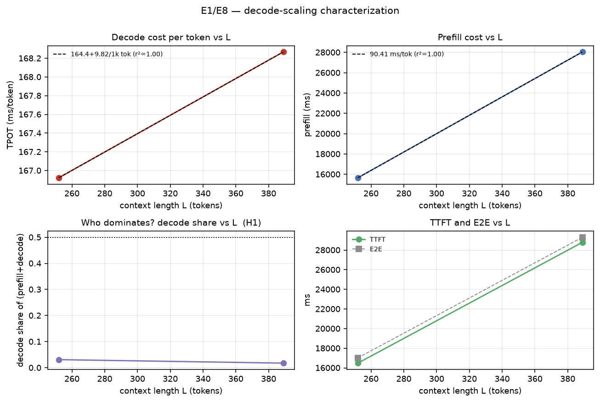
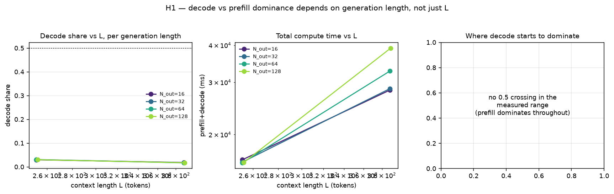
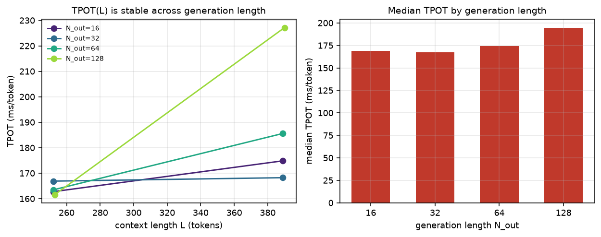
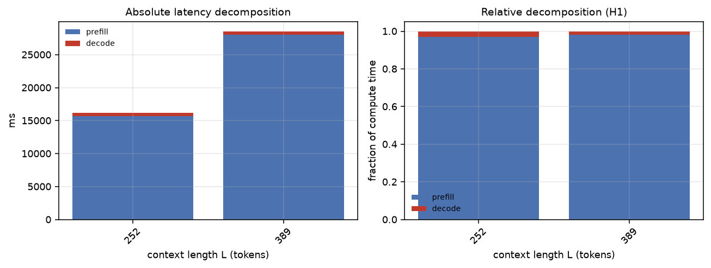
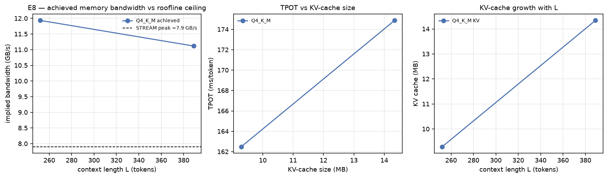
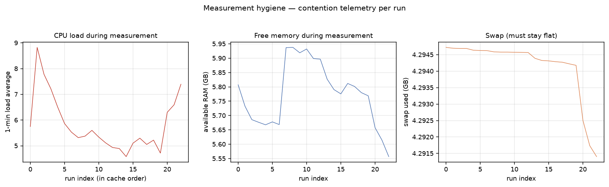
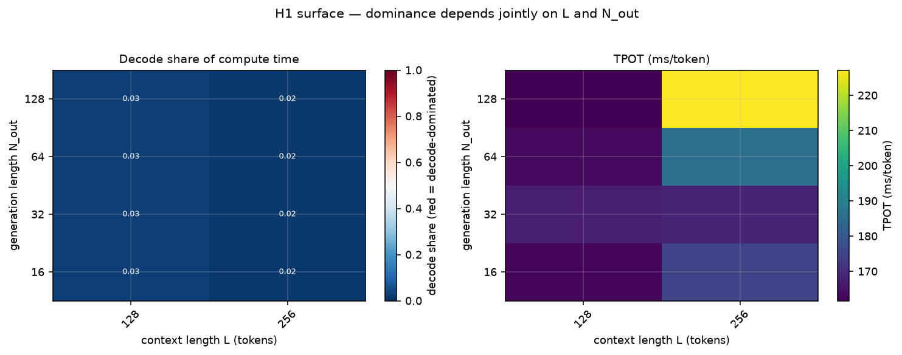
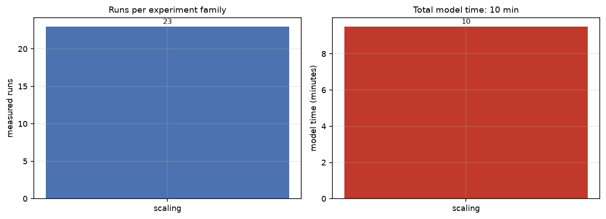

> # ⚠️ DISCARDED — DO NOT USE, DO NOT CITE
>
> Auto-generated at 14:03 on 2026-10-09 from 23 Phase-A runs measured while swap was
> **100% exhausted** (4,092 / 4,095 MB). The machine was thrashing. Every latency number
> below is roughly **15x inflated** and the fits derived from them are meaningless.
>
> | | this file | known-good pilot |
> |---|---|---|
> | prefill | 62-90 ms/token | **4.1 ms/token** |
> | TPOT | 167 ms | **37 ms** |
>
> Two internal tells confirm it independently: the reported achieved bandwidth
> (11.6 GB/s) **exceeds the measured STREAM ceiling** (7.9 GB/s), which is physically
> impossible — the STREAM probe was itself run under load and under-measured the
> ceiling; and `N_out = 3` is nonsense for a 32-token generation budget.
>
> Only 2 of 7 context lengths and 0 of 2,200 compression runs completed, so sections
> 2-7 are empty regardless.
>
> Kept solely as a record of the failure mode. See `WHY_DISCARDED.md`.

# DECAF — Full Experimental Results

CPU-only · Intel(R) Core(TM) i7-8665U CPU @ 1.90GHz, 4 cores / 8 threads, 17 GB RAM, Linux · 23 scaling runs, 0 compression runs, 0 KV-study runs

> Absolute latencies are machine-specific. The **shapes, crossovers and break-even behaviour** are the transferable results.

## 1. Decode scaling (RQ1 / E1, E8)

- `TPOT(L) ≈ 164.45 + 9.818` ms per 1k context tokens (r²=1.00)
- `prefill(L) ≈ 90.41` ms/token (r²=1.00)
- decode/prefill crossover at **L ≈ 84 tokens** (N_out = 3)

|   prompt_tokens |   prefill_ms |   decode_ms |   tpot_ms |   ttft_ms |   e2e_ms |   decode_share |   prefill_ms_per_tok |   achieved_bw_gbs |   n |
|----------------:|-------------:|------------:|----------:|----------:|---------:|---------------:|---------------------:|------------------:|----:|
|             252 |      15661.9 |      500.77 |    166.92 |   16484.8 |  17025.5 |           0.03 |                62.15 |             11.62 |   3 |
|             389 |      28048.1 |      504.8  |    168.27 |   28792.5 |  29303.6 |           0.02 |                72.1  |             11.56 |   3 |

- measured STREAM ceiling: **7.9 GB/s** (copy 7.9, triad 5.0); achieved decode bandwidth is in the table above (E8).

## 2. Break-even context length L* (RQ2 / E3, E4)

## 3. Compression: quality, grounding, latency (RQ3 / E2, E7)

`contains_gold` and `answer_recall` are verbosity-robust companions to EM/F1; `e2e_norm_ms` fixes the generation length at 32 tokens so a method cannot look faster merely by emitting a shorter answer.

## 4. Component analysis and λ sweep (Sec. 17)

## 5. Statistics (Sec. 21)

## 6. Quantization interaction (RQ4 / E5)

_Single quantization measured; run `--secondary` for the Q8 comparison._

## 7. Secondary analysis: KV reuse and prefetch (H5)

_Not yet run._

## 8. Measurement hygiene

- contention guard: median load1 during runs = 5.38, median free RAM = 5.8 GB
- num_ctx held constant within each family (scaling 20480, compression 4096) so KV allocation does not confound L.
- every measured run carries a unique prefix nonce, so no prefill is reused except in the KV study where reuse is the object of measurement.

## 9. Extended figures

## 10. Figure index

- `fig01_scaling_core.png`
- `fig02_genlen_crossover.png`
- `fig03_tpot_by_genlen.png`
- `fig04_latency_decomposition.png`
- `fig05_roofline.png`
- `fig23_crossover_heatmap.png`
- `fig19_contention.png`
- `fig35_study_cost.png`
