# DECAF — Full Experimental Results

CPU-only · Intel(R) Core(TM) i7-8665U CPU @ 1.90GHz, 4 cores / 8 threads, 17 GB RAM, Linux · 4 scaling runs, 24 compression runs, 2 KV-study runs

> Absolute latencies are machine-specific. The **shapes, crossovers and break-even behaviour** are the transferable results.

## 1. Decode scaling (RQ1 / E1, E8)

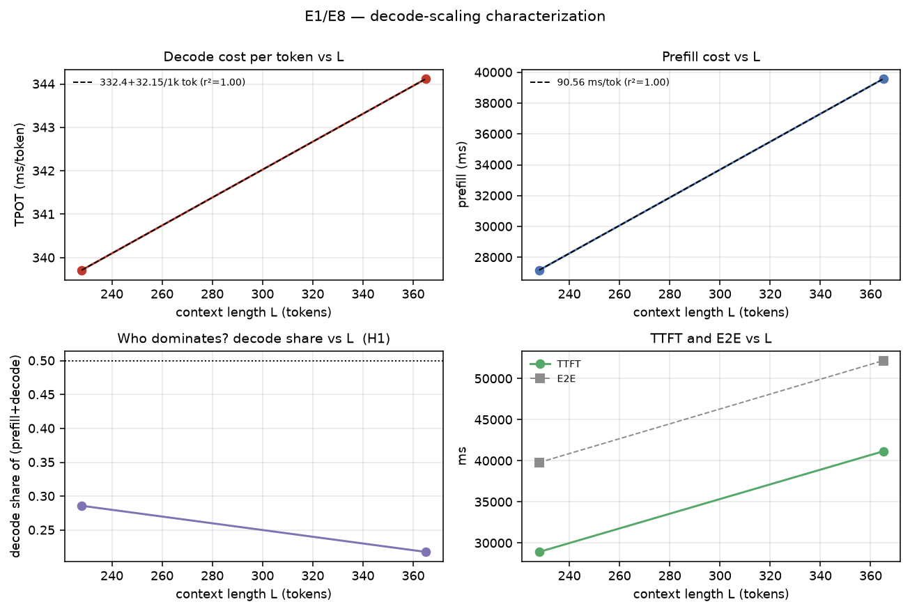

- `TPOT(L) ≈ 332.38 + 32.151` ms per 1k context tokens (r²=1.00)
- `prefill(L) ≈ 90.56` ms/token (r²=1.00)
- decode/prefill crossover at **L ≈ 46 tokens** (N_out = 32)

|   prompt_tokens |   prefill_ms |   decode_ms |   tpot_ms |   ttft_ms |   e2e_ms |   decode_share |   prefill_ms_per_tok |   achieved_bw_gbs |   n |
|----------------:|-------------:|------------:|----------:|----------:|---------:|---------------:|---------------------:|------------------:|----:|
|             228 |      27167.1 |     10870.8 |    339.71 |   28922.2 |  39800.9 |           0.29 |               119.15 |              5.71 |   1 |
|             365 |      39573.7 |     11011.7 |    344.12 |   41159.2 |  52188.9 |           0.22 |               108.42 |              5.65 |   1 |

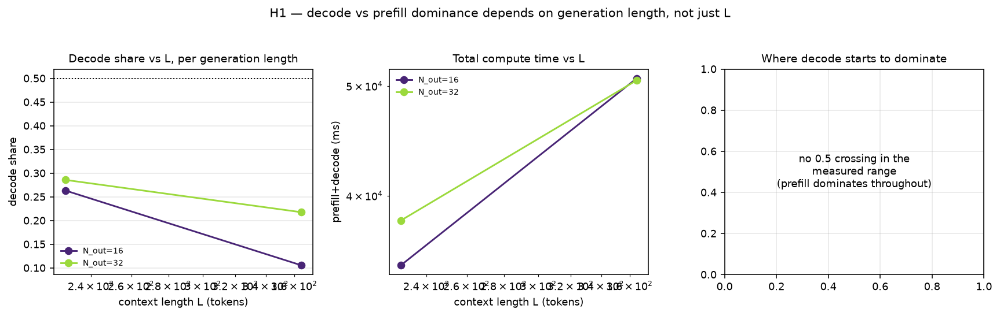

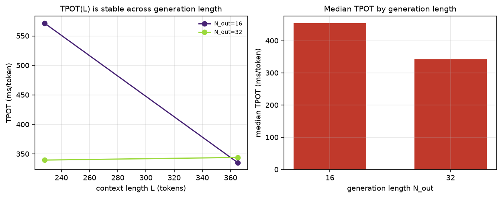

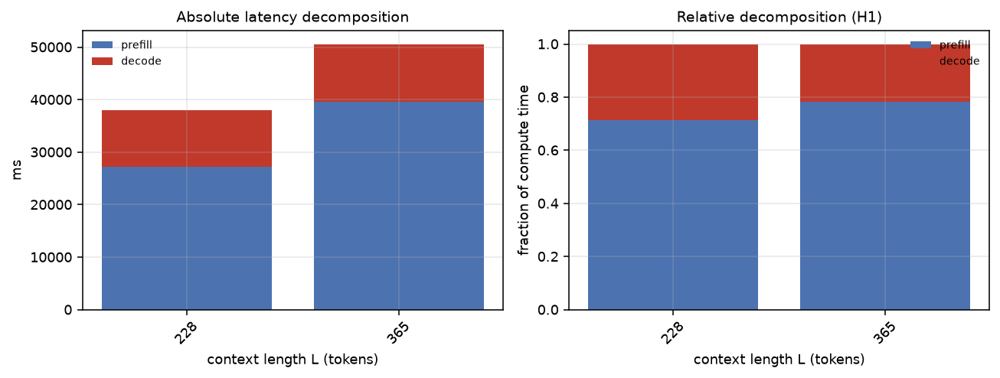

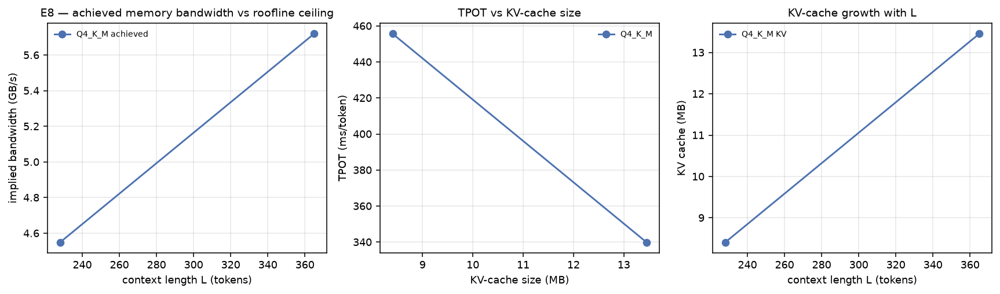

## 2. Break-even context length L* (RQ2 / E3, E4)

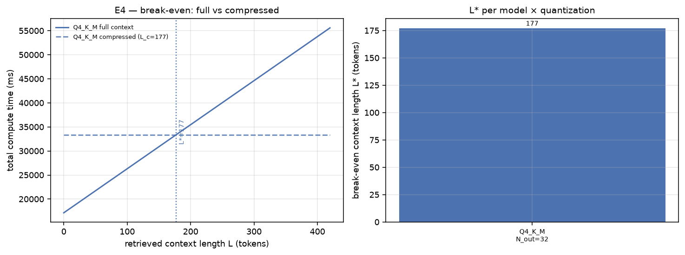

- **Q4_K_M** (N_out=32): retained `L_c`≈177 tok, `T_compress`=3.92 ms, marginal cost 91.59 ms/token → **`L*` ≈ 177 tokens** (prefill 90.56 + decode 1.03 ms/token)

## 3. Compression: quality, grounding, latency (RQ3 / E2, E7)

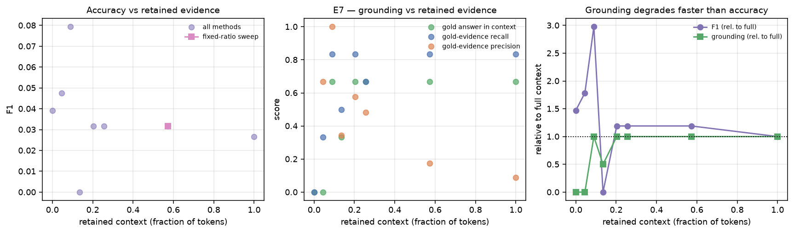

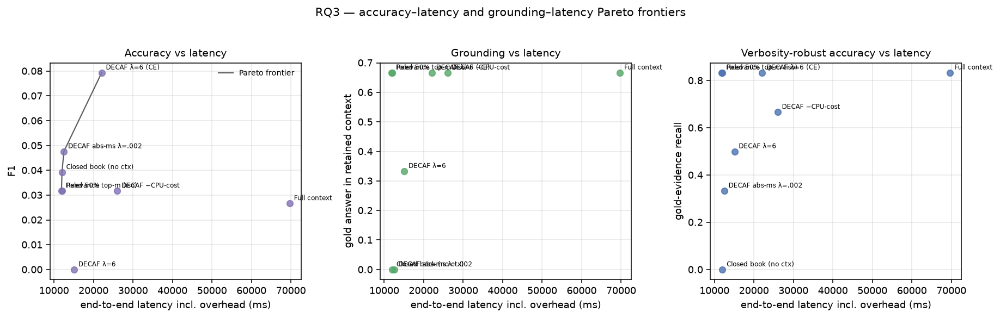

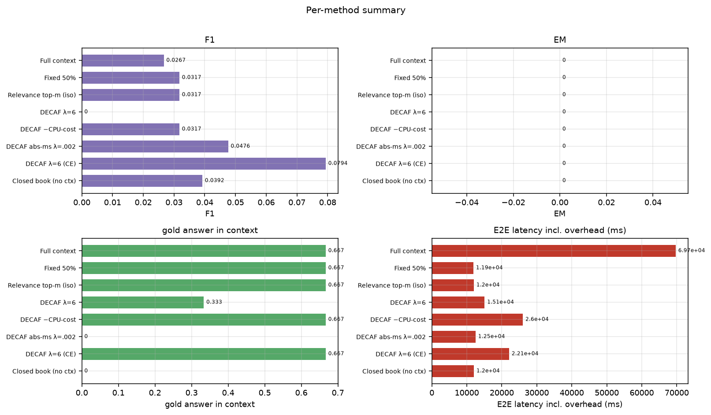

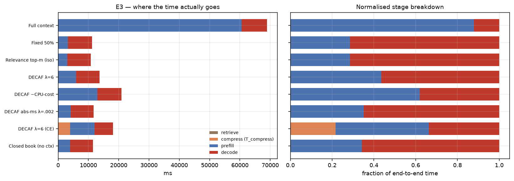

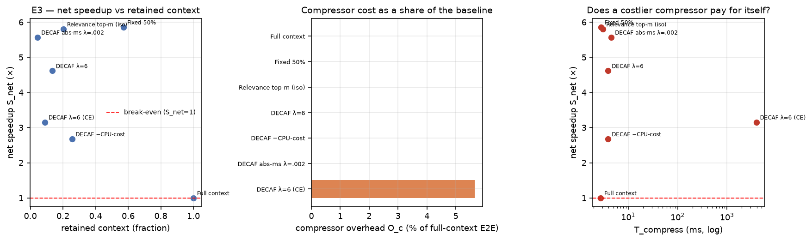

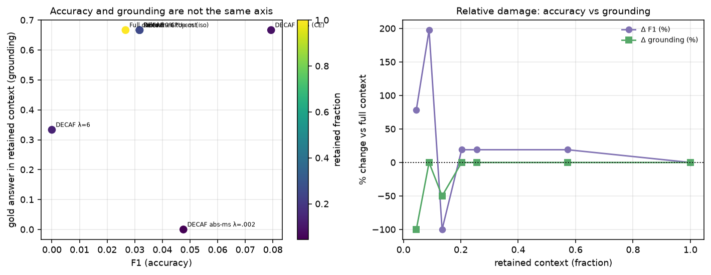

| method                |    f1 |   em |   evidence_recall |   evidence_precision |   gold_in_evidence |   retained_ratio |   compress_ms |   prefill_ms |   decode_ms |   e2e_ms |   e2e_total_ms |   net_speedup |   overhead_frac |   QE_f1_per_sec |   n |
|:----------------------|------:|-----:|------------------:|---------------------:|-------------------:|-----------------:|--------------:|-------------:|------------:|---------:|---------------:|--------------:|----------------:|----------------:|----:|
| Full context          | 0.027 |    0 |             0.833 |                0.089 |              0.667 |            1     |         2.769 |     60561.1  |     8365.73 |  69696.6 |        69704.1 |         1     |           0     |           0     |   3 |
| Fixed 50%             | 0.032 |    0 |             0.833 |                0.175 |              0.667 |            0.572 |         2.829 |      3184.28 |     8000.72 |  11885.6 |        11893.2 |         5.861 |           0     |           0.003 |   3 |
| Relevance top-m (iso) | 0.032 |    0 |             0.833 |                0.578 |              0.667 |            0.203 |         3.035 |      3072.6  |     7738.19 |  12002.2 |        12010   |         5.804 |           0     |           0.003 |   3 |
| DECAF λ=6             | 0     |    0 |             0.5   |                0.344 |              0.333 |            0.135 |         3.92  |      5940.55 |     7704.48 |  15084.9 |        15093.6 |         4.618 |           0     |           0     |   3 |
| DECAF −CPU-cost       | 0.032 |    0 |             0.667 |                0.483 |              0.667 |            0.255 |         3.927 |     12940.8  |     7954.74 |  26012   |        26020.7 |         2.679 |           0     |           0.001 |   3 |
| DECAF abs-ms λ=.002   | 0.048 |    0 |             0.333 |                0.667 |              0     |            0.045 |         4.564 |      4120.32 |     7599.6  |  12499.9 |        12509.2 |         5.572 |           0     |           0.004 |   3 |
| DECAF λ=6 (CE)        | 0.079 |    0 |             0.833 |                1     |              0.667 |            0.089 |      3938.32  |      8096.52 |     6120.67 |  18139.1 |        22082.2 |         3.157 |           0.057 |           0.004 |   3 |
| Closed book (no ctx)  | 0.039 |    0 |             0     |              nan     |              0     |            0     |         0     |      3926.53 |     7573.94 |  12025.5 |        12030.3 |         5.794 |           0     |           0.003 |   3 |

`contains_gold` and `answer_recall` are verbosity-robust companions to EM/F1; `e2e_norm_ms` fixes the generation length at 32 tokens so a method cannot look faster merely by emitting a shorter answer.

## 4. Component analysis and λ sweep (Sec. 17)

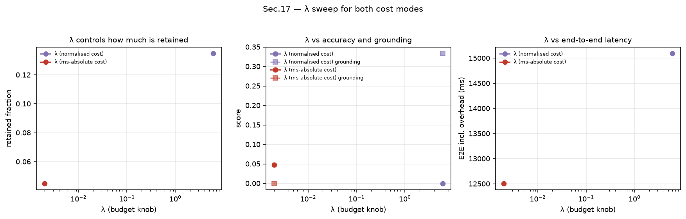

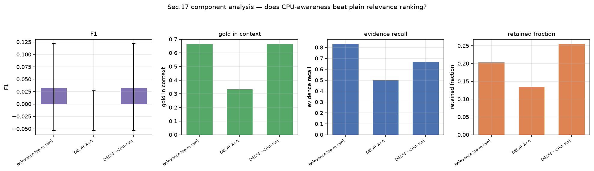

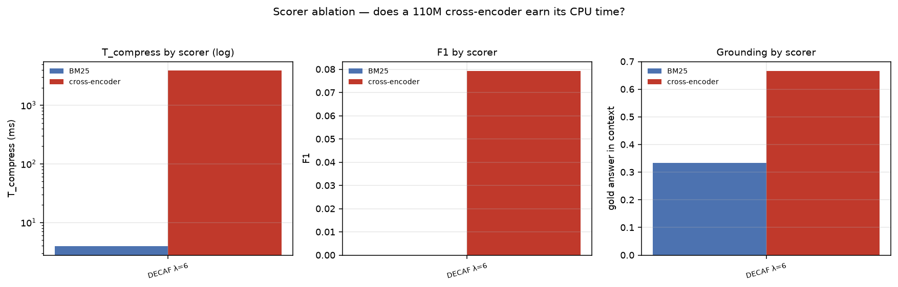

## 5. Statistics (Sec. 21)

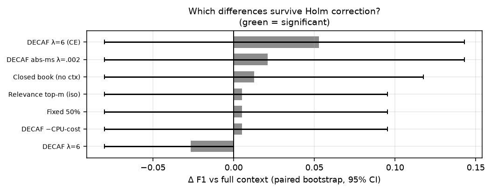

| method                |   n_paired |   f1_delta |   f1_delta_lo |   f1_delta_hi |   f1_p_boot | holm_sig   |   em_p_mcnemar |   grounding_delta |   e2e_delta_ms |
|:----------------------|-----------:|-----------:|--------------:|--------------:|------------:|:-----------|---------------:|------------------:|---------------:|
| Closed book (no ctx)  |          3 |     0.0125 |         -0.08 |        0.1176 |      0.8475 | False      |              1 |           -0.6667 |       -70878.9 |
| DECAF abs-ms λ=.002   |          3 |     0.021  |         -0.08 |        0.1429 |      0.8475 | False      |              1 |           -0.6667 |       -70222.3 |
| DECAF λ=6 (CE)        |          3 |     0.0527 |         -0.08 |        0.1429 |      0.5355 | False      |              1 |            0      |       -67496.4 |
| DECAF λ=6             |          3 |    -0.0267 |         -0.08 |        0      |      0.5755 | False      |              1 |           -0.3333 |       -69285.5 |
| DECAF −CPU-cost       |          3 |     0.0051 |         -0.08 |        0.0952 |      0.821  | False      |              1 |            0      |       -63106.5 |
| Fixed 50%             |          3 |     0.0051 |         -0.08 |        0.0952 |      0.821  | False      |              1 |            0      |       -71451.2 |
| Relevance top-m (iso) |          3 |     0.0051 |         -0.08 |        0.0952 |      0.821  | False      |              1 |            0      |       -71702.9 |

All comparisons are paired per query against full context; F1/grounding use a 4000-sample paired bootstrap, EM uses exact McNemar, and `holm_sig` applies Holm–Bonferroni across the method family.

## 6. Quantization interaction (RQ4 / E5)

_Single quantization measured; run `--secondary` for the Q8 comparison._

## 7. Secondary analysis: KV reuse and prefetch (H5)

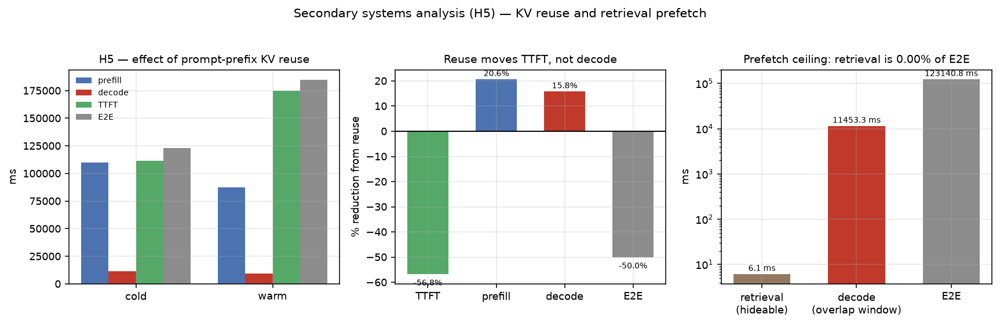

- prompt-prefix reuse changes TTFT by **-56.8%**, prefill by 20.6%, decode by 15.8%, E2E by **-50.0%**
- retrieval is 0.00% of E2E, so prefetch can hide at most that much

## 8. Measurement hygiene

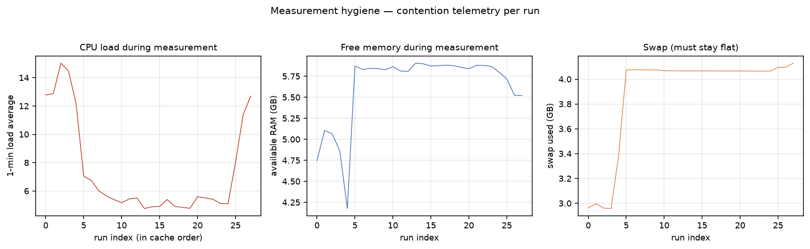

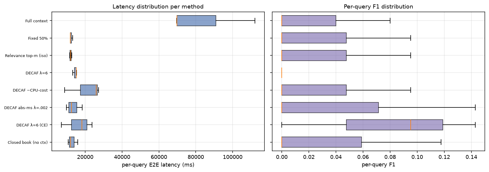

- contention guard: median load1 during runs = 13.68, median free RAM = 5.0 GB
- num_ctx held constant within each family (scaling 20480, compression 4096) so KV allocation does not confound L.
- every measured run carries a unique prefix nonce, so no prefill is reused except in the KV study where reuse is the object of measurement.

## 9. Extended figures

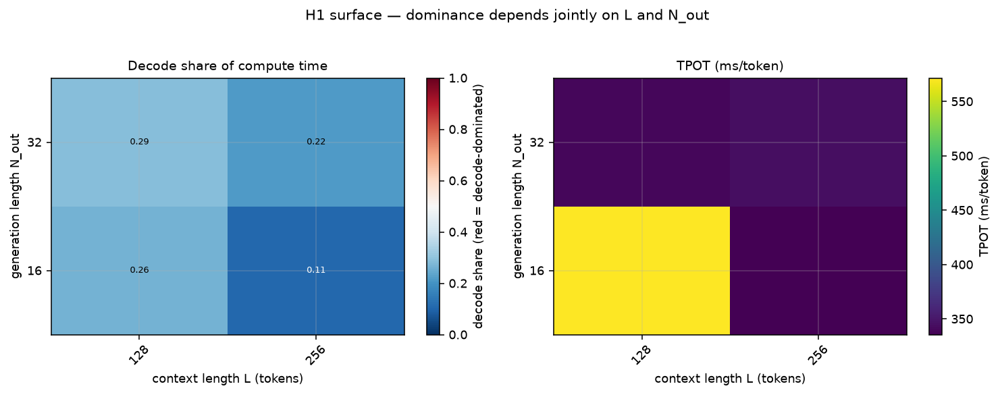

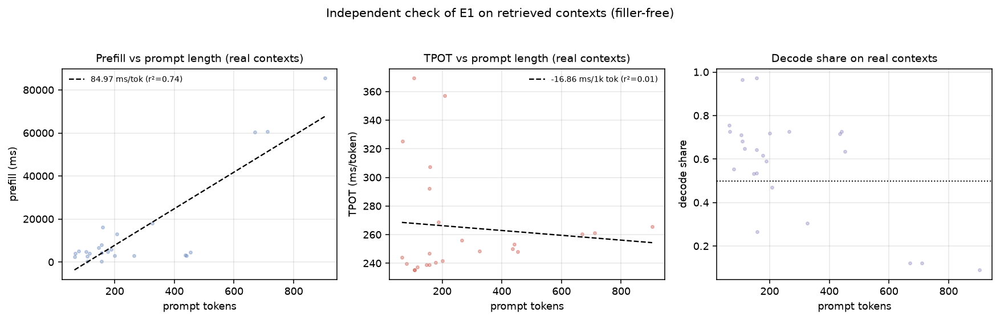

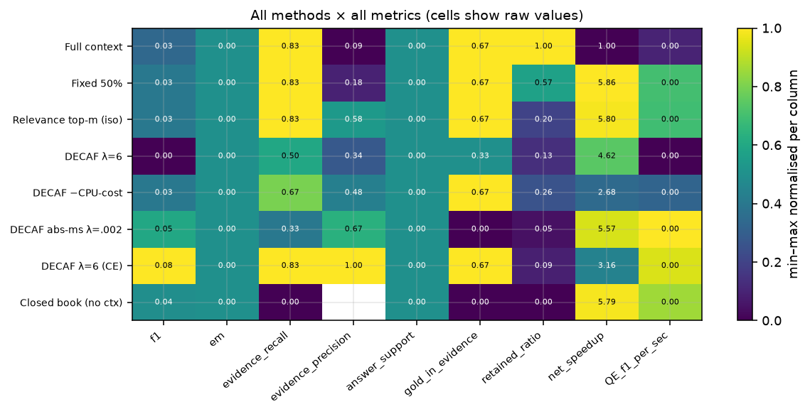

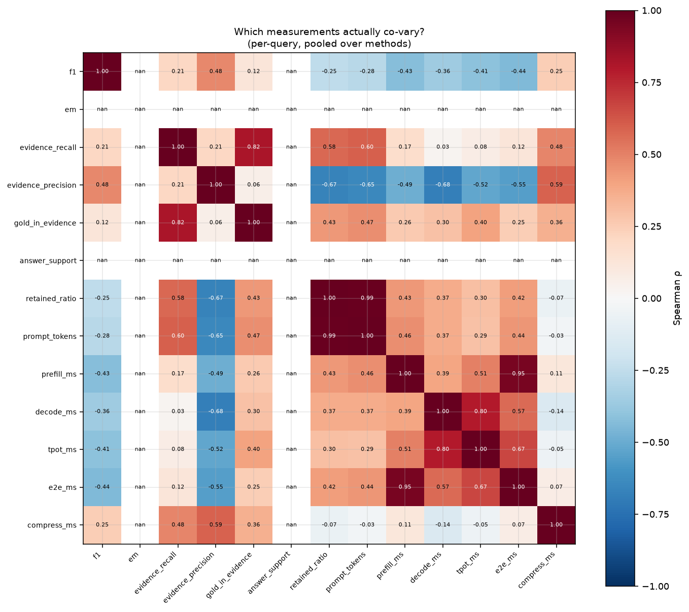

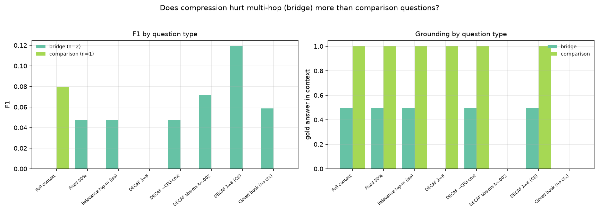

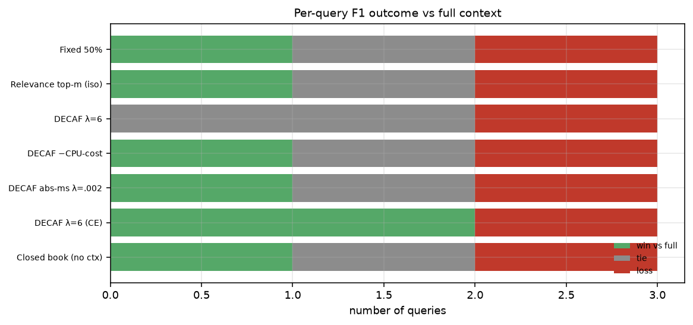

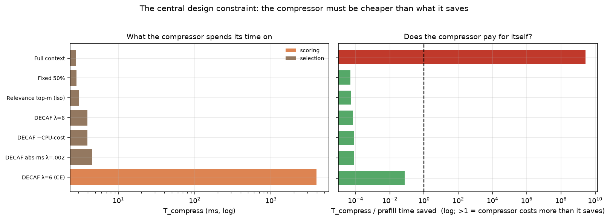

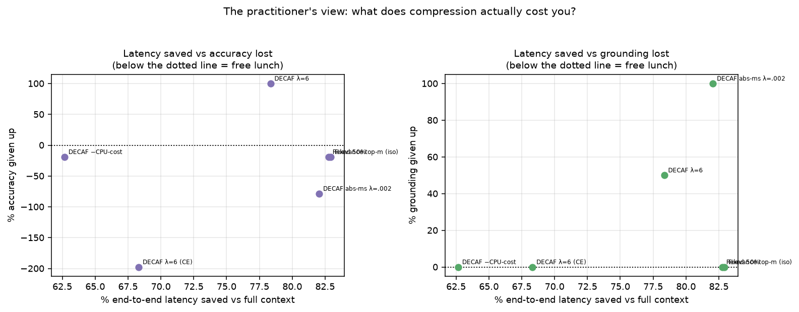

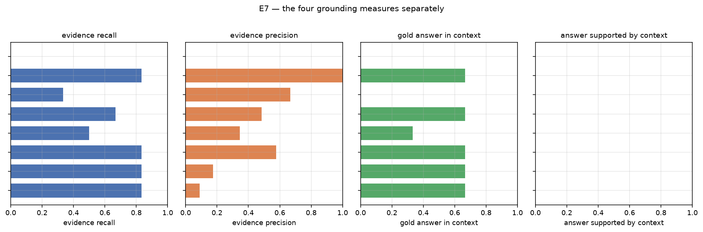

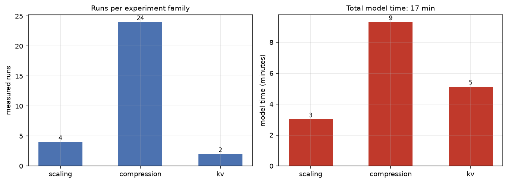

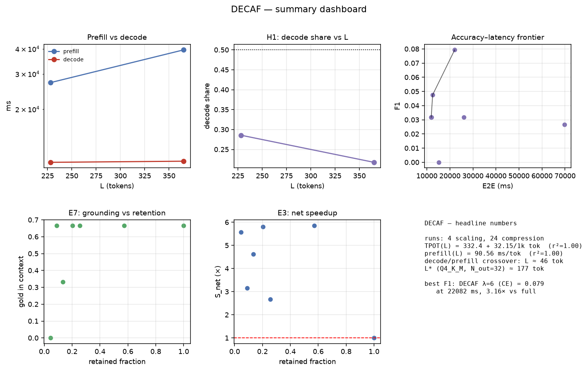

## 10. Figure index

- `fig01_scaling_core.png`
- `fig02_genlen_crossover.png`
- `fig03_tpot_by_genlen.png`
- `fig04_latency_decomposition.png`
- `fig05_roofline.png`
- `fig07_ratio_quality.png`
- `fig08_pareto.png`
- `fig09_method_bars.png`
- `fig10_latency_stack.png`
- `fig11_overhead_speedup.png`
- `fig12_scorer_tradeoff.png`
- `fig13_lambda_sweep.png`
- `fig14_ablation.png`
- `fig15_break_even.png`
- `fig17_grounding_vs_accuracy.png`
- `fig21_significance.png`
- `fig20_variance.png`
- `fig23_crossover_heatmap.png`
- `fig24_real_context_scaling.png`
- `fig25_metric_heatmap.png`
- `fig26_metric_correlation.png`
- `fig27_qtype_breakdown.png`
- `fig28_win_loss.png`
- `fig29_compressor_cost.png`
- `fig32_tradeoff.png`
- `fig33_grounding_components.png`
- `fig18_kv_reuse.png`
- `fig19_contention.png`
- `fig35_study_cost.png`
- `fig22_dashboard.png`
